# 🔄 Flujos de Negocio - Ferretería POS

## 1. Flujo de Venta en POS

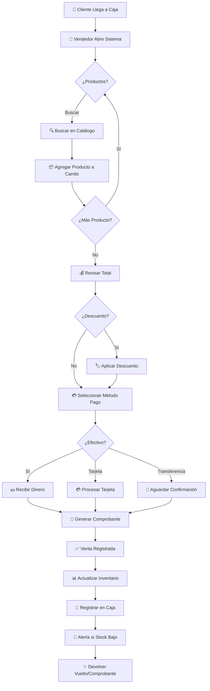

---

## 2. Flujo de Compra a Proveedor

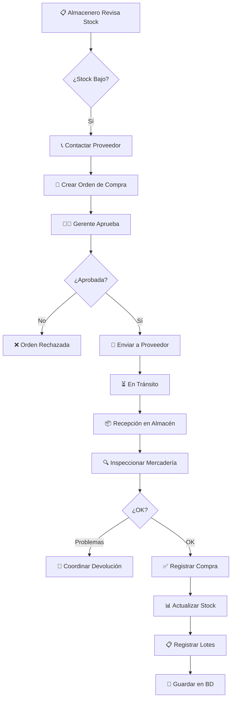

---

## 3. Flujo de Devolución/Cambio

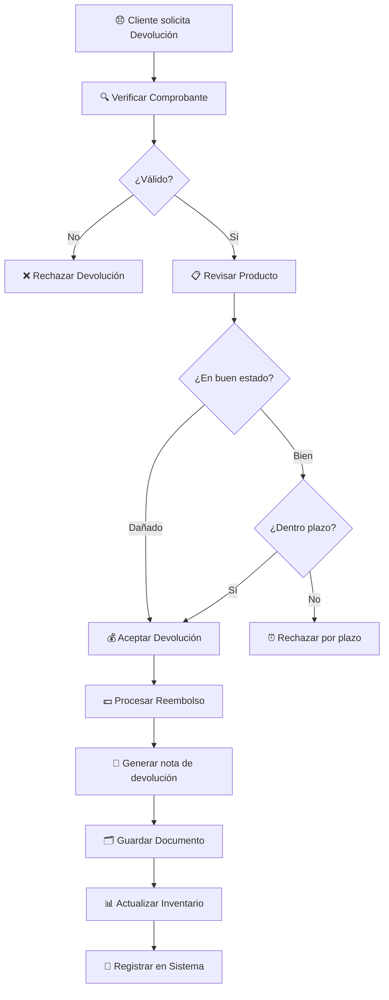

---

## 4. Flujo de Cierre de Caja

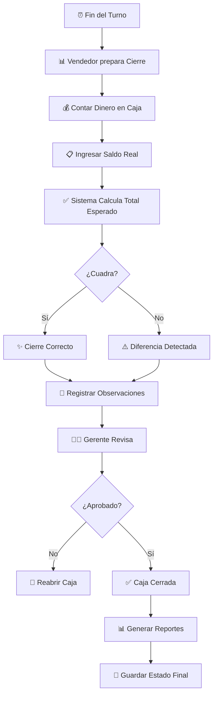

---

## 5. Flujo de Auditoría y Seguridad

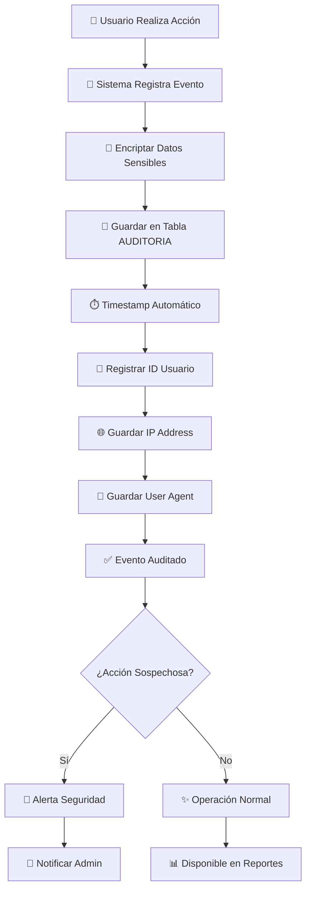

---

## 6. Flujo de Alertas de Inventario

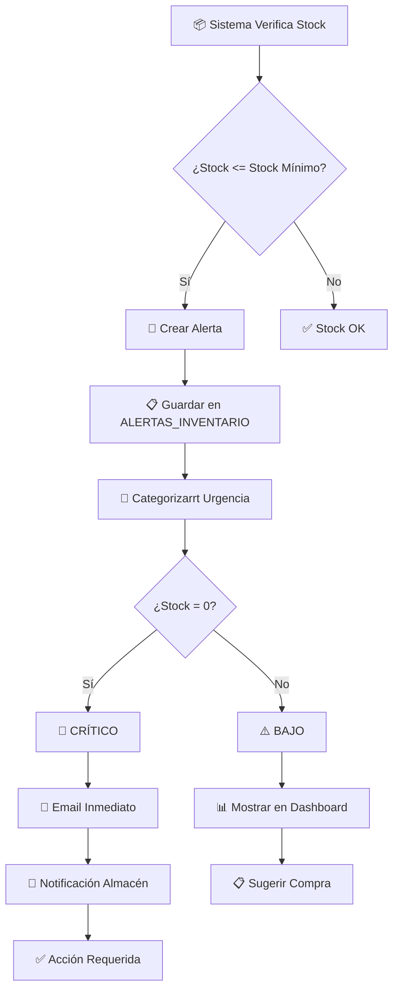

---

## 7. Flujo de Reportes y Analytics

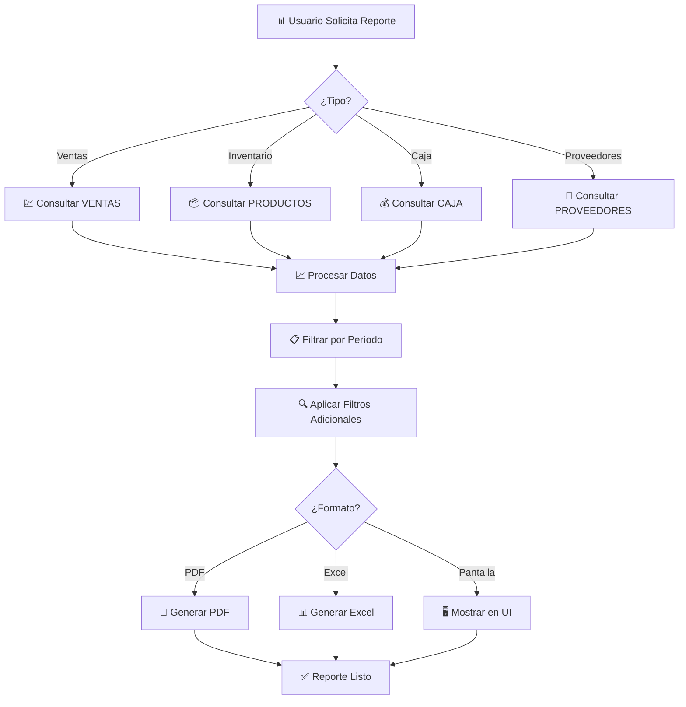

---

## 8. Flujo de Autenticación y Autorización

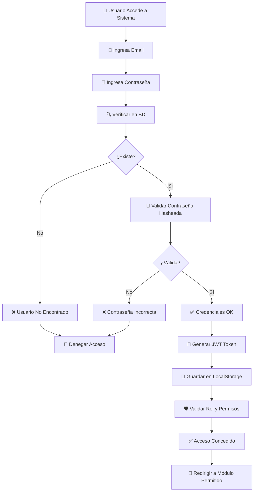

---

## 9. Flujo de Gestión de Proveedores

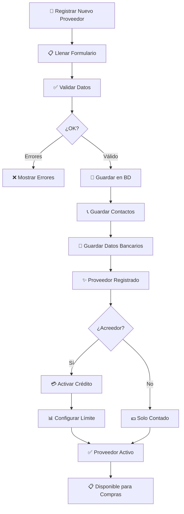

---

## 10. Flujo Completo: De Compra a Venta

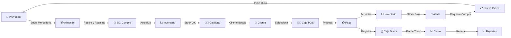

---

## 11. Matriz de Productos - Ciclo de Vida

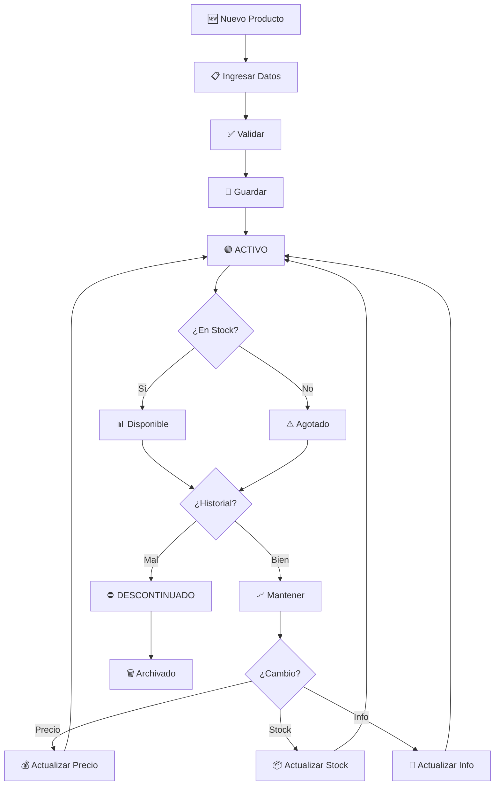

---

## 12. Estado de Usuarios - RBAC

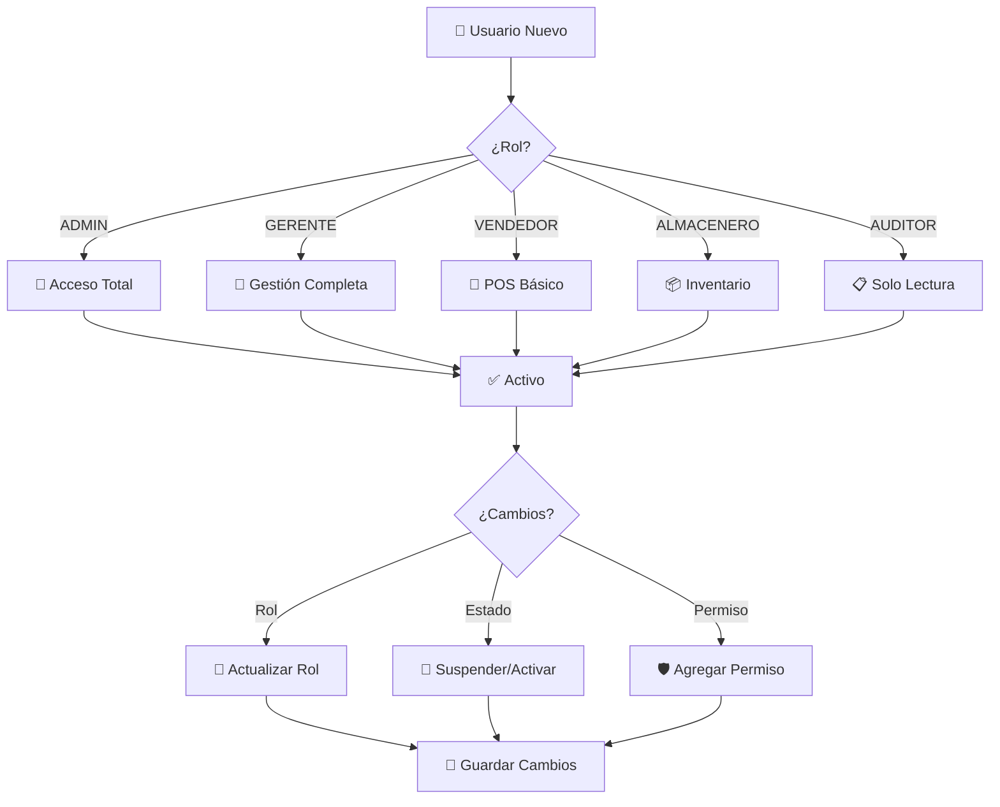

---

## Leyenda de Símbolos

| Símbolo | Significado |
|---------|------------|
| 👤 | Usuario/Actor |
| 📱 | Sistema/Interfaz |
| 💾 | Operación en BD |
| ✅ | Éxito/Completado |
| ❌ | Error/Rechazado |
| 🔔 | Alerta/Notificación |
| 💰 | Operación Financiera |
| 📊 | Reporte/Análisis |
| 🔐 | Seguridad |
| ⏰ | Tiempo/Fecha |

---

**Versión**: 1.0  
**Última Actualización**: 27 Marzo 2026  
**Diagramas**: Mermaid

